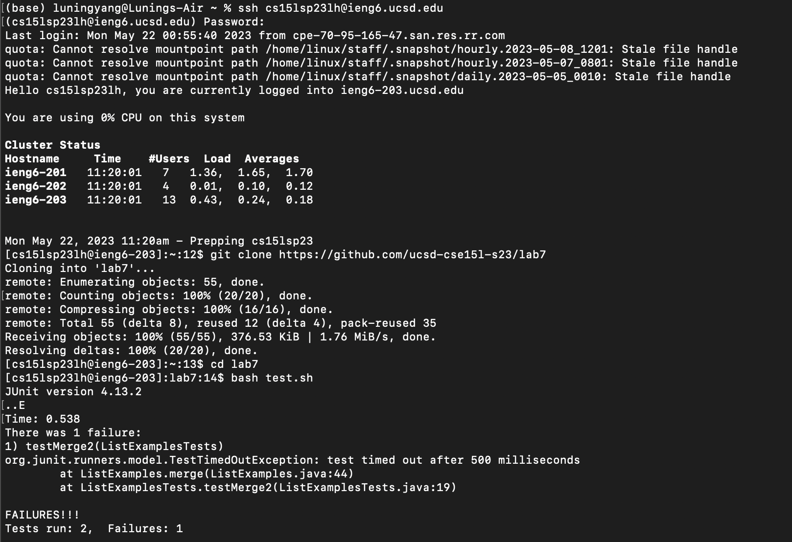
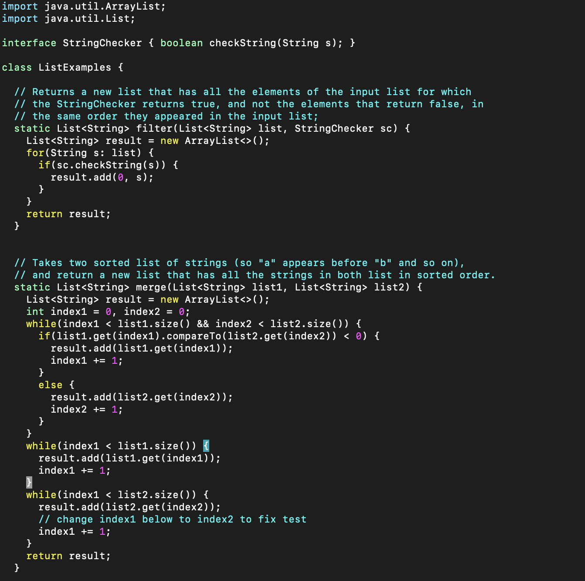
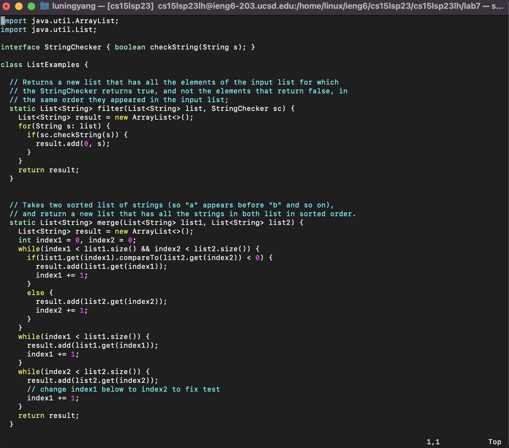
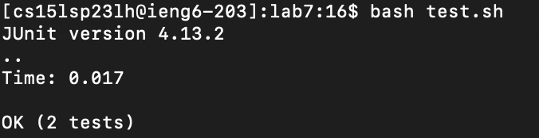
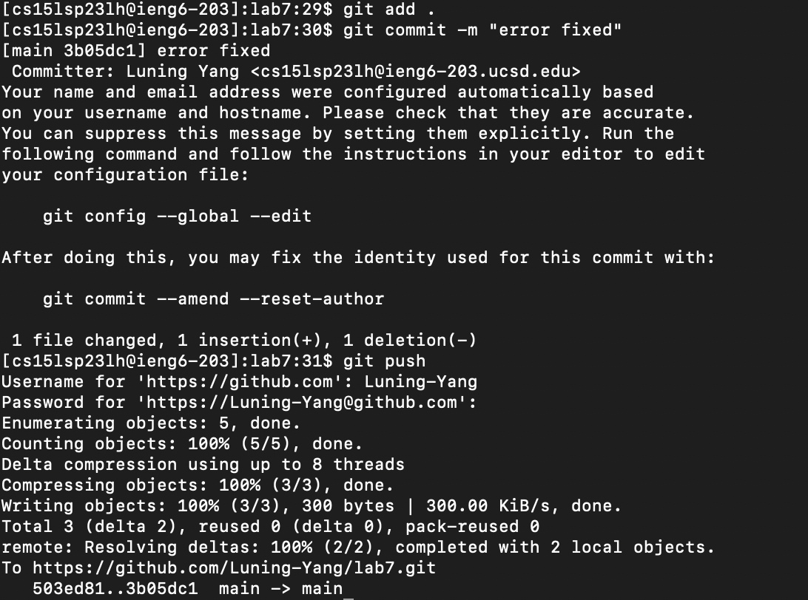

# Lab Report 4 - Fixing code using vim (Week 8)
The lab report showcases how to use vim to edit and fix the errors in ListExamples.java, which is located at https://github.com/ucsd-cse15l-s23/lab7.

1. Before we start this lab. Make sure we don't have any other forks of the repository on our account first.
2. Make a fork of the above repository.
3. Start the timer to see how fast we can complete the task.
4. Before we start our code fixing procedure, we have to clone the above repository to our ieng6 environment. So we log into our ieng6 account first (with the zz replaced by the letters in your course-specific account):
```
$ ssh cs15lsp23zz@ieng6.ucsd.edu
```
5. After successfully log into the account, clone the forked repository from https://github.com/Luning-Yang/lab7.git and cd into the repository.
```
$ git clone https://github.com/Luning-Yang/lab7.git
$ cd lab7
```
6. Run the test.sh file inside the file to demonstrate that ListExamples.java indeed has some errors in it.
```
$ bash test.sh
```
Here is a screenshot of the steps 1 to 3:



7. The following part demonstrates exactly how to edit the code file to fix the failing test using vim. To summarize, we type `/test<enter>jhhhhhi<backspace>2<esc>:wq<enter>` to fix the error and save the file to the correct version. The detals of how each command means are as follow.
  - we use `vim ListExamples.java` to "vim" into the file first. We can see how the file looks like
  
  - type `/test<enter>` to search for the comment right above the part we need to fix.
  - type `j` to go down to the line where our error is located and type `hhhhh` to go left 5 times to arrive at exactly one space before index1. 
  - type `i` to go to the insert mode and type `<backspace> 2` to delete the original 1 and replace it with 2.
  - type `<esc>` to go back to the normal mode and type `:wq <enter>` to save and quit. Here is how the fixed file looks like 
  

8. We run the tests and demonstrate that they now succeed
```
bash test.sh
```


9. Commit and push the resulting change to your Github account
```
git add .
git commit -m "error fix"
git push
```



