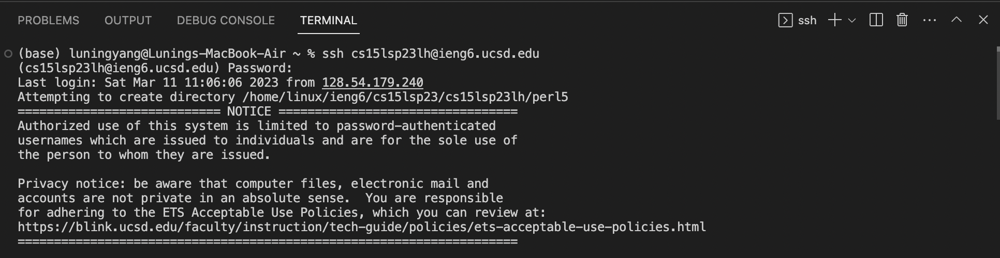

## Introduction
In this tutorial, you will learn how to access and manage files on the UCSD CSE15L file system. We will cover the process of logging in and operating the files. The following tutorial only applies to users with Mac/Linux system. 


## Installing VScode
Before we logging in the file system, we have to make sure that VScode is properly installed. If you haven't installed it yet, follow the below steps:
1. Go to [https://code.visualstudio.com](https://code.visualstudio.com)
2. Click the **Download Mac Universal** to download the VS studio for mac.


## Remotely Connecting
After we successfully installed the VScode, we can follow the below steps to establish the remote connection to the server.

1. Before we connect to the remote server, we have to get git bash installed (https://git-scm.com/download/mac). 

2. After we install git bash, press `control` + ``` ` ```, and you will see a window asking for your cse15l account username (replace `lh` with letters in your own username) and password. 



3. After you enter both your usename and password, you will be directed to the UCSD CSE15L file system. Once we successfully login the system, we will see the following page.


## Command Tryout
The following image contains some command line tryout in the login window.


Here is a table which documents the commands I've tried and their respective results.

| Command       | Description | Result        |
| ------------- |------------- | ------------- |
|  `ls` | It lists the all files and folders under the current directory | `perl5`  |
| `cd perl5`  |It directs to the perl5 directory | It's under `~/perl5` directory now  |
| `pwd`  |It checks the current directory | The current directory is `~/perl5` now  |

