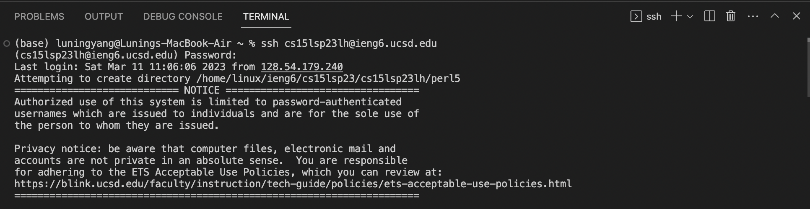
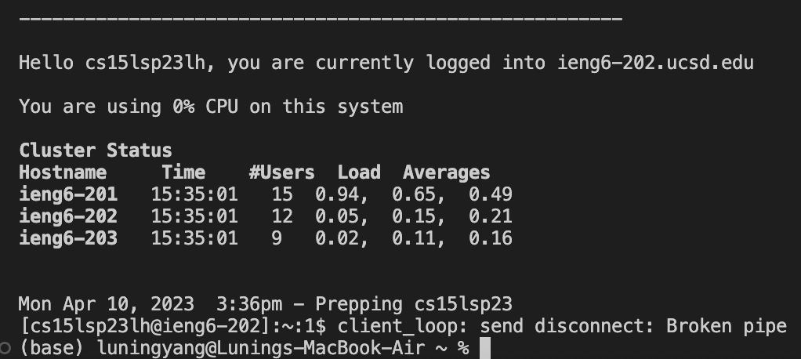

# Lab Report 1

## Installing VScode
1. Go to [https://code.visualstudio.com](https://code.visualstudio.com)
2. Click the **Download Mac Universal**


## Remotely Connecting
After we successfully installed the VScode, press `control` + ``` ` ```, and you will see a window asking for your cse15l account username (replace `lh` with letters in your own username) and password. 



After we successfully login, we will see the following page.



