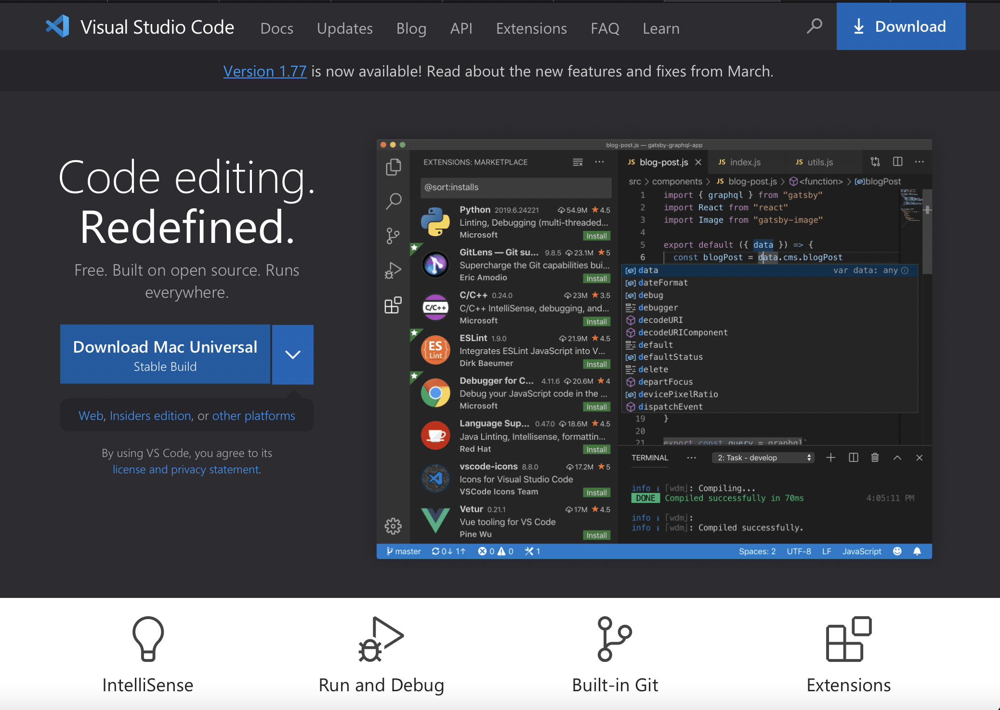

# Lab Report 1

## Installing VScode
1. Go to [https://code.visualstudio.com](https://code.visualstudio.com)
2. Click the **Download Mac Universal**


## Remotely Connecting
After we successfully installed the VScode, press `control` + `````
