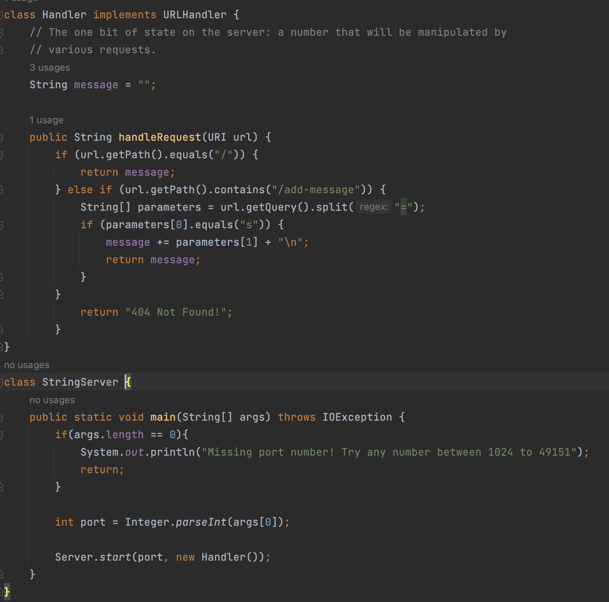
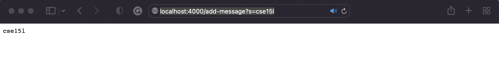
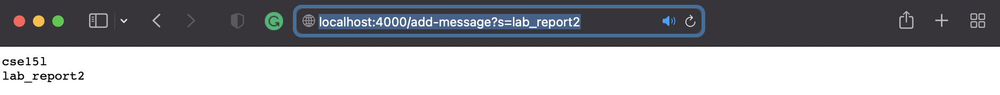
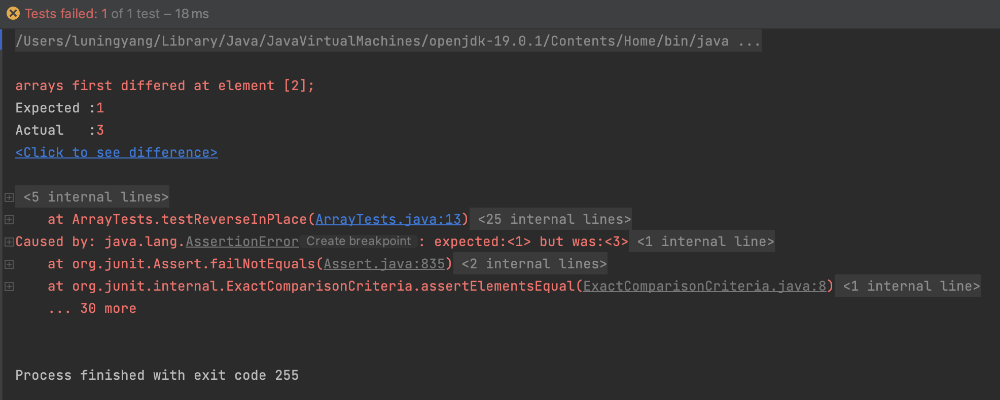

# Lab Report 2 - Servers and Bugs (Week 3)

## Part 1
Below is an implementation of a web server called *StringServer* that supports the path and behavior as following: it starts from an empty string `message`. Everytime we call `/add-message?s=<string>`. It appends `<string>` to the message, starts a new line, and displays `message`.



Then, we go to the directory where *StringServer* is located. We run the following commands:
1. `javac Server.java StringServer.java` (compile the  *StringServer* file)
2. `java StringServer 4000` (start the *StringServer* with port number 4000)
Now, we have successfully started our *StringServer*. We can visit it directly through this url "http://localhost:4000".

Next, let's validate that our *StringServer* work properly.
1. We visit it through this url "http://localhost:4000//add-message?s=cse15l" first. This calls the `handleRequest` in Handler class. The relevant argument to this method is the `url` parameter. This request append the string "cse15l" with a new line to the initial empty string, which means message has been changed tp "cse15l\n". We can see that the page displays *cse15l*.


2. We visit it through this url "http://localhost:4000//add-message?s=lab_report2" next. This calls the `handleRequest` in Handler class. The relevant argument to this method is the `url` parameter. This request append the string "lab_report2" to the next line of "cse15l". We can see that *lab2_report2* is successfully appended to the next line of *cse15l*, which means message has been changed to "cse15l\nlab2_report2\n". Our *StringServer* is implemented successfully.



## Part 2
Below is a java method called `reverseInPlace` with a certain bug. 
```
static void reverseInPlace(int[] arr) {
    for(int i = 0; i < arr.length; i += 1) {
      arr[i] = arr[arr.length - i - 1];
    }
}
```
1. A failure-inducing input
```
@Test 
public void testReverseInPlace() {
    int[] input2 = { 1, 2, 3 };
    ArrayExamples.reverseInPlace(input2);
    assertArrayEquals(new int[]{ 3, 2, 1 }, input2);
}
```

2. A non-failure-inducing input
```
@Test 
public void testReverseInPlace() {
    int[] input1 = { 3 };
    ArrayExamples.reverseInPlace(input1);
    assertArrayEquals(new int[]{ 3 }, input1);
}
```

3. The symptom: run both tests above. We got the following error messages.


4. The bug & Debug:
The line `arr[i] = arr[arr.length - i - 1];` only assigns the first half of the array with the values from the second half of the array. When i goes beyond `arr.length/2`, the values in the first half of the array have already been changed. As a result, we fail to swap the values of the second half of the array with the values from the first half of the array. To fix this issue, we need to introduce a temp variable to facilitate the value swap. Another problem in the code is the condition `i < arr.length;`. If we iterate through the entire array, the values will be swapped back when we reach the second half of the array. To resolve this, we need to change the condition to `i < arr.length/2`; so that we only iterate through half the array length. The changed code looks like the following.
```
static void reverseInPlace(int[] arr) {
    for(int i = 0; i < arr.length/2; i += 1) {
      int temp = arr[i];
      arr[i] = arr[arr.length - i - 1];
      arr[arr.length - i - 1] = temp;
    }
}
```


  
